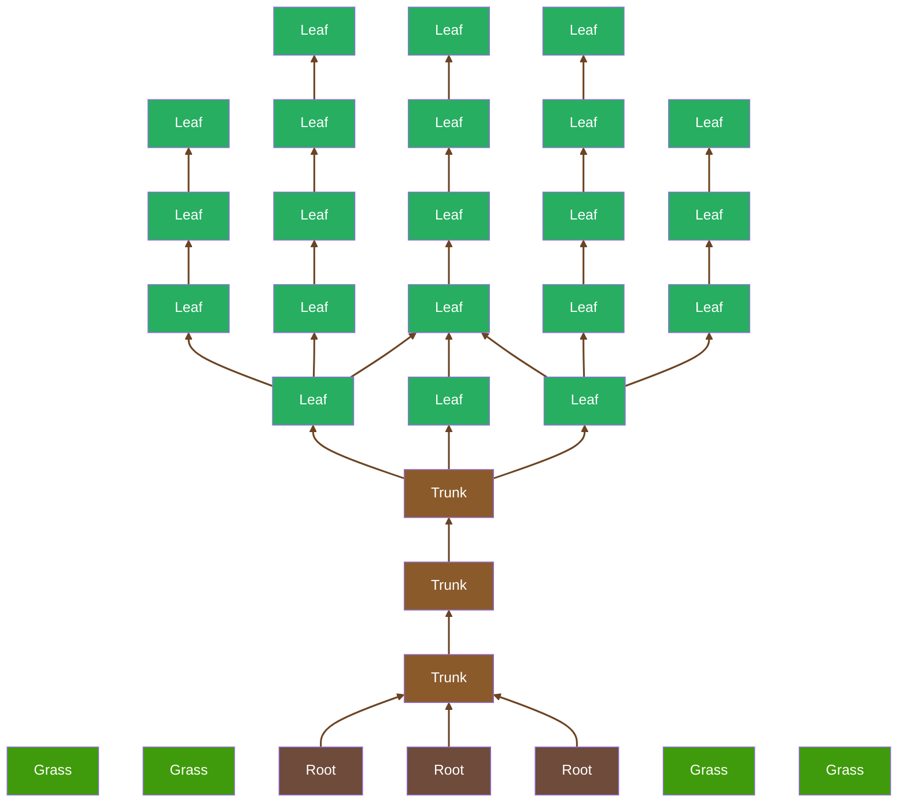

Morning, I'm `LucaVmu`and you can find me under that name everywhere.

I like to break iOS's limits (for fun)

Stuff I know:
- Bash and SH
- C
- React and the Webstack

and I'm learing Objective-C and Swift.

<!-- Why are you looking here? 👁️ 👁️ -->

<kbd>

    

        <picture>
            
        </picture>
    

</kbd>

