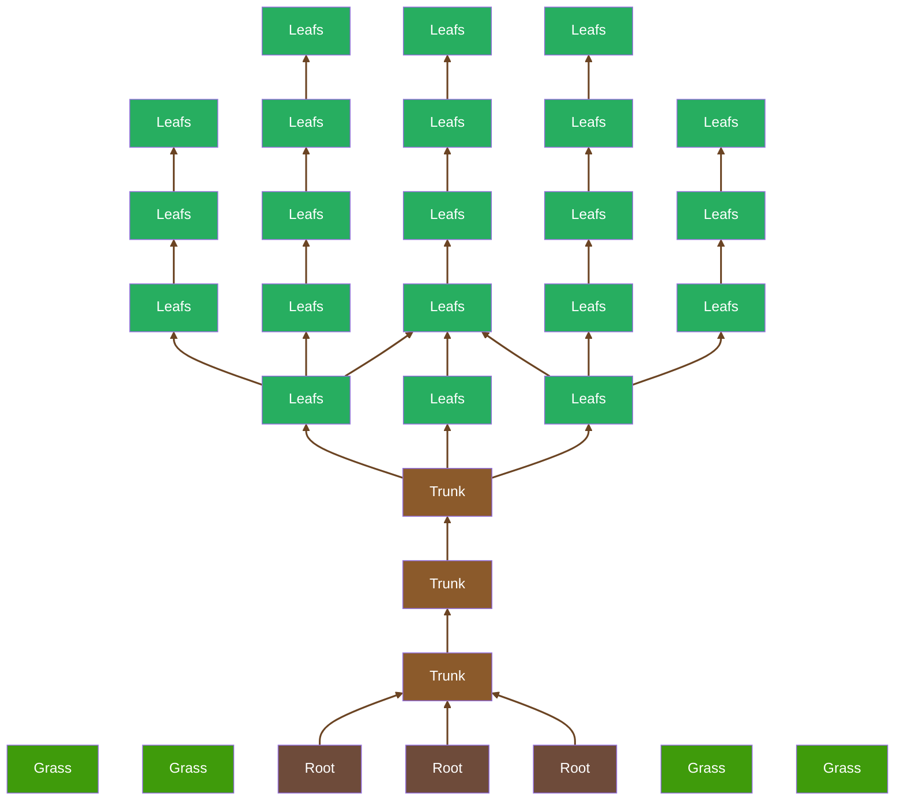

# About me

Hello, I'm `LucaVmu` and have been fascinate in programming since I was 12. Since then I learned various programming [languages](#languages) and skills.

Here are the kind of things I programm:
- Coding IDE's
- System modifications
- DIY projects

# Languages

  
Currently I'm learing Objective-C and Swift.

# Contact
You will find my under LucaVmu in most well known plattforms.  
Here is my business Email: `lucavmu@emexlab.org`

<!-- Feel free to copy my README ;) -->

#

<kbd>

    

        <picture>
            
        </picture>
    

</kbd>

